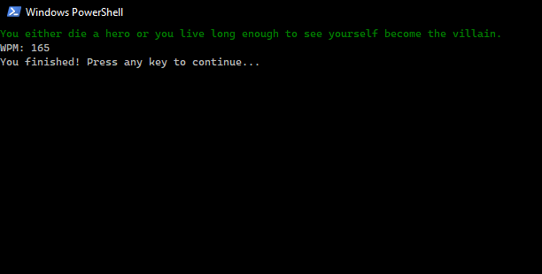

# Typing Game (Python Terminal App)

A terminal-based typing test built using Python and the `curses` library. This project calculates WPM (words per minute) in real time.

## How It Works

- Press any key to start the test
- Type the quote that appears as accurately as you can
- Your WPM is displayed live while typing
- The game ends once you complete the sentence

## Features

- WPM tracking
- Real-time feedback with green/red highlighting
- A variety of quotes loaded from a text file
- Error handling for strange key inputs (apostrophes, quotes, etc.)

## Screenshot

